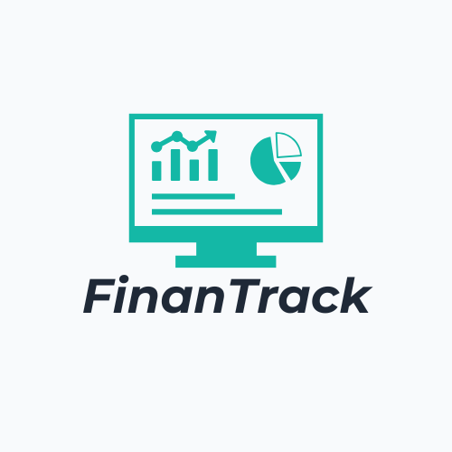
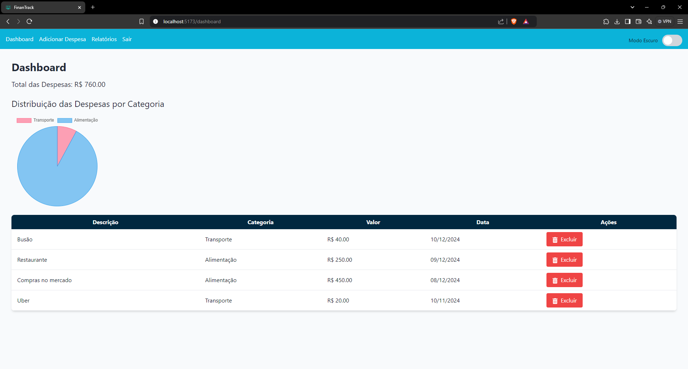

# FinanTrack


Este é o repositório do Projeto Final Web, desenvolvido como parte do curso de desenvolvimento web.

## Descrição

O projeto consiste em uma aplicação web completa, utilizando tecnologias modernas para o front-end e back-end. O objetivo é demonstrar as habilidades adquiridas ao longo do curso.

## Tecnologias Utilizadas

- **Front-end:**
     - React
     - TypeScript
     - TailwindCSS

- **Back-end:**
     - Node.js
     - Express
     - MySQL

## Funcionalidades

- Autenticação de usuários
- CRUD de dados
- Interface responsiva
- Integração com API externa

## Captura de Tela



## Como Executar o Projeto

1. Clone o repositório:
      ```bash
      git clone https://github.com/joaopedroplinta/projeto-final-web.git
      ```

2. Navegue até o diretório do projeto:
      ```bash
      cd projeto-final-web
      ```

3. Instale as dependências:
      ```bash
      npm install
      ```

4. Inicie o servidor:
      ```bash
      npm start
      ```

5. Acesse a aplicação no navegador:
      ```
      http://localhost:3000
      ```

## Contribuição

Contribuições são bem-vindas! Sinta-se à vontade para abrir issues e pull requests.
